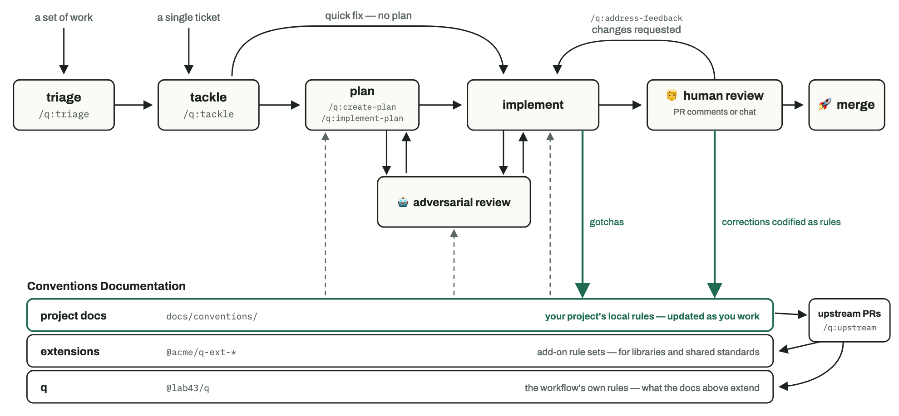

# q

A Claude Code plugin packaging an agentic coding workflow: skills for planning, implementing, verifying, and grooming, grounded in per-project conventions docs that each consuming project builds up over time.

Named for Q, the quartermaster who equips James Bond with his gadgets — q outfits your agents before they go into the field.

## Install

```
claude plugin marketplace add lab43/claude-plugins && claude plugin install q@lab43
```

Then run `/q:install-q` in each project that will use the workflow.

## Skills

<!-- source: each skill's SKILL.md frontmatter description -->

| Skill | What it does |
| --- | --- |
| `/q:install-q` | Install q into a project: declare the plugin pin, install the conventions pack, scaffold `docs/conventions/`, and index both tiers in the agent briefing. Idempotent, safe to re-run. |
| `/q:update-q` | Sync the installed q to the project's pins — plugin and conventions pack — and optionally move both to the latest releases, reconciling the project with what changed. |
| `/q:install-pack` | Install a third-party doc pack and index its docs in the agent briefing. |
| `/q:update-pack` | Sync a third-party doc pack to its pin, and optionally move the pin to the latest release, reconciling the project with what changed. |
| `/q:update-docs` | The single write path for doc changes — record a lesson, fix a guide, amend the briefing. |
| `/q:evaluate` | Evaluate code against the project's conventions, where either side may be the one to change. |
| `/q:groom-docs` | Audit the whole documentation surface against the documentation policy and consolidate what has drifted. |
| `/q:upstream` | Turn session friction and recorded deviations into PRs against the repos that own the rules — the q framework's or a doc pack's. |

## How it works

<!-- (source: docs/workflow-chart/chart.html) — regenerated by docs/workflow-chart/screenshot.py -->
<a href="docs/workflow-chart/light.png">
  <picture>
    <source media="(prefers-color-scheme: dark)" srcset="docs/workflow-chart/dark.png">
    
  </picture>
</a>

q's effect on your repo comes from context routing and documentation discipline — everything it produces is plain markdown in your repo, and it works in one loop:

**Every session starts knowing where the rules are.** `/q:install-q` scaffolds `docs/conventions/` — your project's conventions, one doc per topic, seeded with a `principles.md` for your cross-cutting rules and a `documentation.md` for your documentation rulings — installs q's framework conventions as the `@lab43/q-conventions` npm pack, pinned in your `package.json`, and indexes both tiers in your agent briefing (`AGENTS.md` or `CLAUDE.md`). So every agent session, whether or not it ever invokes a q skill, is told to check both tiers of conventions — q's and yours — before writing code, making design decisions, or changing docs; your recorded decisions bind future sessions instead of living in one person's head.

**Decisions become conventions as you make them.** The scaffold is deliberately near-empty, because conventions are earned as decisions are made, not pre-written. When a session hits a decision, lesson, or gotcha worth binding, `/q:update-docs` records it under q's documentation policy — phrased as a rule, one home per fact, placed where its next reader will look.

**Grooming keeps the docs true.** `/q:groom-docs` periodically verifies the whole documentation surface against the code and the policy — accuracy, duplication, dead references — so the docs agents are routed to stay worth trusting, which is what makes the routing worth anything.

**You stay in charge.** q's framework conventions (documentation policy, cross-cutting principles) install read-only as a pinned npm pack and improve with pin updates, but your project's rulings win on conflict — record the disagreement and it stands (see the markers below). Deletions, reorganizations, commits, and PRs are proposed, never applied unilaterally. And since it's all markdown in your repo, removing the plugin leaves your docs intact and yours.

## Markers

<!-- source: q conventions/documentation.md, Markers -->

q's documentation keeps every fact in exactly one authoritative home, but text still needs to point at, copy, or disagree with facts that live elsewhere. Markers declare which of those relationships is in play — making them visible to readers and checkable by grep, with no central list to maintain:

| Marker | Meaning |
| --- | --- |
| `(see: X)` | Plain cross-reference — nothing copied, the detail lives at X. |
| `(source: X)` | This text is a copy and X is the authority — `/q:groom-docs` checks that the copy still agrees with X. |
| `(overrides: X)` | This rule deliberately replaces the named one — a q framework rule (`overrides: q conventions/documentation.md, Code examples`), a doc pack's rule (`overrides: @acme/q-docs-x conventions/retries.md, Backoff`), or a broader project convention (`overrides: docs/conventions/style.md, Magic numbers`). `/q:groom-docs` respects it, and `/q:upstream` picks up overrides worth carrying to the rule's owner. |

## Developing q

<!-- source: docs/conventions/documentation.md, The tier test -->

This repo has two conventions directories, by design. `packages/q-conventions/conventions/` is the framework: policy that ships with the plugin — and publishes as the `@lab43/q-conventions` npm doc pack — and binds every consuming project. `docs/conventions/` is q's own project tier — rules for developing q itself (skill authoring, for example) that are not framework law. The split exists because q is a consuming project of its own workflow: it keeps its working docs at the same contract path any consumer would, kept apart from the product it ships.

<!-- source: AGENTS.md, Developing -->

To work on q:

- `claude` in your checkout auto-loads your working copy of the plugin (the repo declares itself as a local marketplace in `.claude/settings.json`); from any other project, `claude --plugin-dir <path to your checkout>` loads it. `/reload-plugins` picks up edits mid-session.
- `claude plugin validate --strict .` checks structure and manifest.
- Releasing — the plugin or the `@lab43/q-conventions` pack — is separate from merging, and PRs never touch a `version`; the steps live in `docs/guides/releasing.md`.
